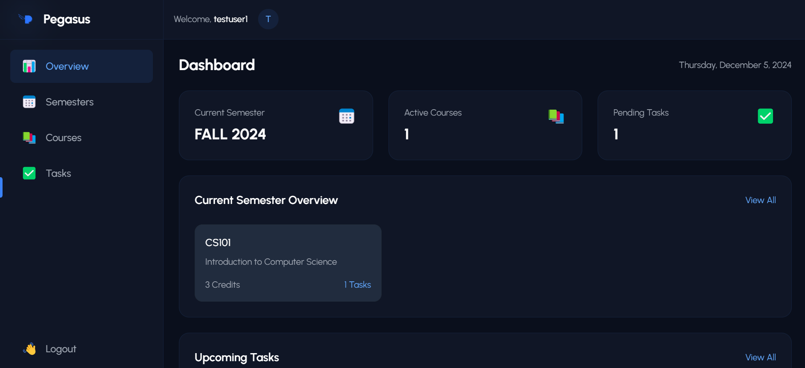

# Pegasus - Academic Course Assistant

Pegasus is a modern web application designed to help students manage their academic journey efficiently. With features like semester planning, course management, and task tracking, Pegasus makes academic organization seamless.

## Features

-   🎯 **Smart Semester Planning**: Organize academic terms with advanced planning tools
-   📚 **Course Management**: Track courses, credits, and progress in one place
-   ✨ **Task Automation**: Smart task management with deadline tracking
-   📊 **Analytics Dashboard**: Get insights into your academic performance

## Tech Stack

### Frontend

-   React.js
-   Tailwind CSS
-   Framer Motion
-   Chart.js
-   Axios

### Backend

-   Django
-   Django REST Framework
-   MySQL
